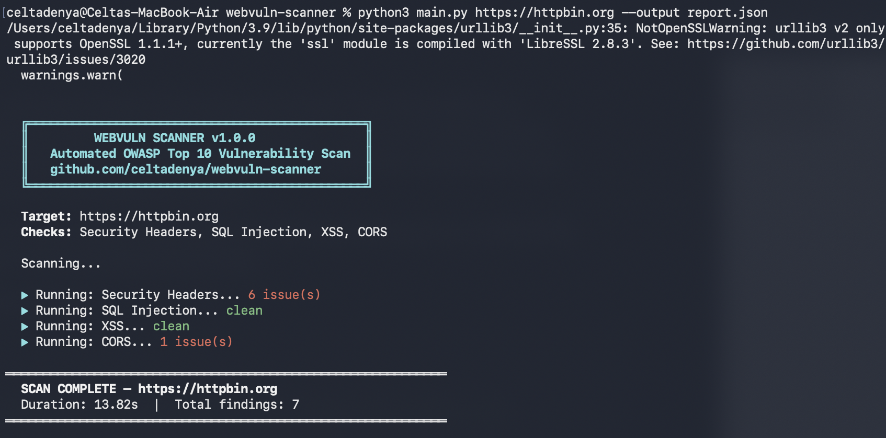
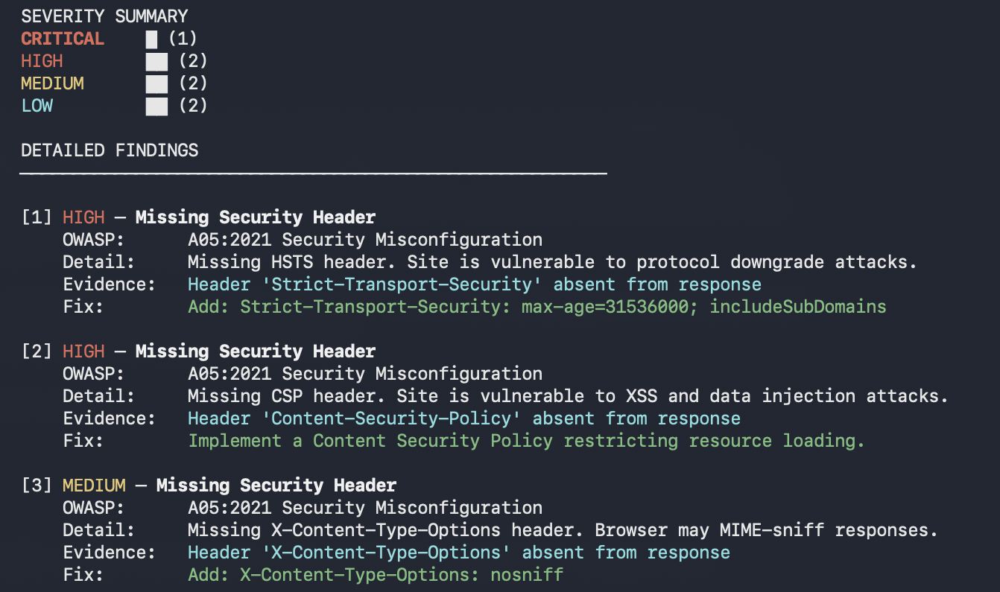
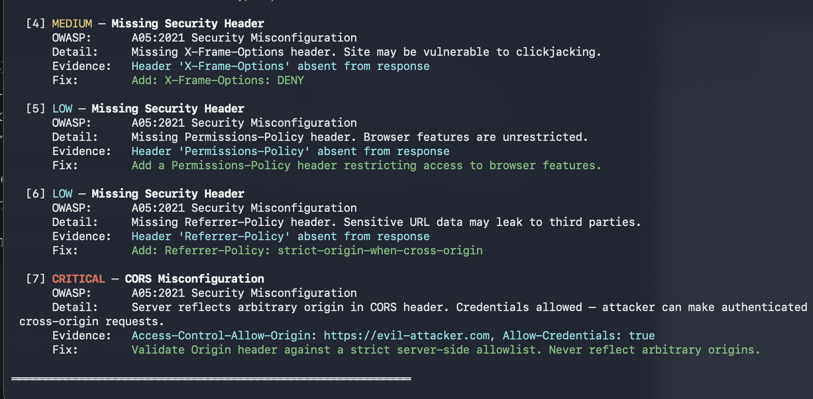

# WebVuln Scanner

An automated web application vulnerability scanner that detects OWASP Top 10 security issues and generates structured reports.

Built by [Celta Denya](https://github.com/celtadenya) - MSc Cybersecurity (Ethical Hacking), Coventry University.

## What It Detects

| Check | OWASP ID | Severity |
|---|---|---|
| Missing security headers (HSTS, CSP, X-Frame-Options) | A05:2021 | LOW to HIGH |
| SQL Injection (error-based, parameter fuzzing) | A03:2021 | CRITICAL |
| Reflected XSS (parameter injection) | A03:2021 | HIGH |
| CORS misconfiguration (wildcard, reflected origin, null origin) | A05:2021 | MEDIUM to CRITICAL |

## Quick Start

Install dependencies and run against any target:

    pip3 install -r requirements.txt
    python3 main.py https://target.com
    python3 main.py https://target.com --output report.json

## Example Output

Scanned https://httpbin.org and found 7 real vulnerabilities including a CRITICAL CORS misconfiguration where the server reflects arbitrary origins with credentials allowed. An attacker can make authenticated cross-origin requests from any domain.

## Project Structure

    webvuln-scanner/
    ├── main.py          - Main runner and CLI
    ├── scanner/
    │   ├── headers.py   - Security header checks
    │   ├── sqli.py      - SQL injection detection
    │   ├── xss.py       - XSS detection
    │   └── cors.py      - CORS misconfiguration checks
    ├── reports/         - JSON report output
    └── requirements.txt - Dependencies

## Roadmap

- Broken authentication detection
- IDOR checks
- PDF report generation
- Sensitive file exposure (.env, .git, config)
- GitHub Actions CI/CD integration

## Legal Notice

For authorised security testing only. Only scan targets you own or have explicit written permission to test.
